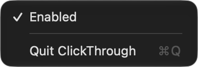

# ClickThrough

A menu bar utility that stops macOS wasting the first click on an inactive window.

Normally, clicking a control in a window that is not the active window only
activates that window; the click itself is discarded and you have to click
again. ClickThrough activates the window's application *before* the click is
delivered, so the click lands where you aimed it. One physical click, one action.

It is **not** focus-follows-mouse: moving the pointer over a window does nothing.
Only an actual click activates anything.

## Install

Download the latest `.dmg` from [Releases](https://github.com/PirouzSR/ClickThrough/releases/latest),
open it and drag **ClickThrough** to Applications. That build is ad-hoc signed
and not notarized, so the first launch needs right-click › **Open** › Open.
It is Apple silicon only; on Intel, build from source.

To build it yourself instead:

1. ```
   ./scripts/build-release.sh
   ```

   (or open `ClickThrough.xcodeproj` in Xcode and build the `ClickThrough` scheme)

2. Drag `build/ClickThrough.app` to `/Applications`.

Either way, then:

3. Launch it once. macOS will ask for Accessibility permission — grant it in
   System Settings › Privacy & Security › Accessibility.
4. Done. It registers itself as a login item, so it starts automatically from
   then on.

`./scripts/make-dmg.sh` produces `build/ClickThrough.dmg` with a
drag-to-Applications layout if you prefer to install that way.

## Using it

The menu bar icon is the entire interface:



* **Enabled** toggles interception. When off, the event tap is torn down and
  macOS behaves exactly as it normally does. The setting persists across launches
  and defaults to on.
* The icon is slashed when disabled, and dimmed when it is enabled but cannot
  work because Accessibility permission is missing. An **Open Accessibility
  Settings…** item appears in the menu only in that case.

There are no other settings.

## How it works

A `CGEventTap` watches left mouse-down. For each one:

1. Read the on-screen window list (front to back) and find the topmost ordinary
   window under the pointer.
2. If that window's application is already frontmost and the window is already
   its front window, do nothing.
3. Otherwise activate that application — raising the specific clicked window
   first if it is not already that application's front window — wait until the
   application reports that it really is frontmost, and then return **the
   original event, unmodified**.

The application therefore receives the user's real click at a moment when it is
already active, so AppKit delivers it to the view instead of swallowing it as an
activation click.

Step 3 has to do three things, not one, and each was found the hard way.

**Wait, do not just ask.** `activate()` only *requests* activation; if the held
mouse-down is released before the application has actually become active,
AppKit still treats it as the activating click and discards it. The wait has a
hard time budget (200 ms, plus at most one Accessibility timeout) so a hung
application can never stall the mouse or push the callback past the event tap's
own limit. That limit was measured directly: the window server left the tap
alone at 1000 ms and disabled it at 1500 ms.

**Wait for the right thing.** Waiting for the application to report
`kAXFrontmost` is not enough - it goes true while the application is still
settling. What matters is that the *clicked window* is the one the application
has focused, so that is what is waited for.

**Raise the clicked window again afterwards.** Activating an application makes
it focus and raise its own last-used window, which throws away any raise
performed beforehand. For an application with a window on each display that
window is on the *other* display, so before this the clicked window was not
focused when the click was released and the click was lost - measured at 0 out
of 8 for a browser in that arrangement, the same as not running at all.

**Put back what the activation displaced.** Activation raises an application's
windows on every display, not only the one being clicked, so a window the user
was working in on another display would vanish behind a window of the
application they clicked elsewhere. Nothing about the click asked for that.
For every display other than the clicked one, the window that was on top is
raised again - immediately, and again at 40, 130 and 310 ms, because the
application raises its own window slightly after being activated. Raising a
window does not change which application is active, so this does not undo the
activation. Measured together: 10 clicks out of 10 delivered, 0 out of 10 with
another display disturbed; in practice an activating click costs 13-40 ms.
No synthetic clicks are ever generated, and no event is ever suppressed. That is
what guarantees one physical click can never become two logical actions.

If the system does disable the tap — which it does to any tap whose callback
runs long — it delivers the "disabled" event only when the *next* event is
routed, so a tap can sit disabled with no callback coming. A watchdog therefore
re-arms it every second, which is the longest the utility can stay dead.


### What it costs

Measured on an M-series laptop with two displays, with the shipping build:

| | |
|---|---|
| Idle | 0.020 s of CPU per 90 s - 0.02% of one core - and 15 MB of memory |
| A click that needs no action | ~1 ms, essentially all of it one window-server query |
| The policy decision itself | 5 µs |
| A click that activates another application | 13-40 ms, almost all of it waiting for that application to be ready |
| Each event of a drag | ~1 µs |

Two things follow from that shape. The window-server query is the whole cost of
an ordinary click, so it is read lazily: a ⌘-click or ⌃-click, or a click while
the system is showing its own UI, is decided without reading it at all and costs
0.1 ms. And micro-optimising the decision logic would be pointless, because at
5 µs it is already 0.5% of the work.

The wait for a slow application is the one unavoidable cost, and it is bounded:
200 ms, against a measured event-tap limit of 1000-1500 ms.

### Deliberate non-interference

A click is passed through untouched when:

* **Command or Control is held.** ⌘-click already means "interact without
  activating" and ⌃-click means "context menu"; both are left to macOS.
* **A menu is open anywhere** (any window at the pop-up-menu level). A click
  then is a dismissal gesture, not an intent to activate something underneath.
* **The pointer is on the menu bar**, taken from the window list: the window
  server keeps a menu bar window only on a display that is actually showing one.
* **The pointer is on the Dock**, taken from the frame the Dock reports for its
  own row of items — which follows the Dock to the left or right edge, and sits
  off the bottom of the display while it is hidden.
* **The Dock is showing a stack** — the fan or grid from a folder in the Dock.
  A click then belongs to the stack, not to whatever is behind the Dock.
* **The frontmost application is system UI** — a Dock menu, the login window or
  a screen saver — **or Mission Control is on screen**, which does not become
  frontmost and so has to be recognised from its own windows.
* **The topmost window under the pointer is not an ordinary window** — a panel,
  popover, tooltip, HUD or system overlay.
* The window belongs to ClickThrough itself, or to a process that cannot be
  activated.

Three window-server details the targeting has to allow for, all observed on
macOS 27:

* **The Dock and Notification Centre each keep a window covering an entire
  display** above ordinary windows, and **the mouse pointer is itself a window**,
  directly under the cursor at all times. Treating any of those as "the window
  you clicked" would make the utility a silent no-op — intermittently, in
  Notification Centre's case. Any window above the ordinary level that spans a
  whole display is therefore treated as a backdrop and looked through.
* Looking through the Dock's backdrop is also why the Dock has to be asked about
  its own clicks: everything it draws, the row of icons and any open stack
  alike, lives inside that one window, and it never becomes frontmost. It is
  only asked for a click that would otherwise activate something, and only when
  its window covers that click — about 0.1 ms.
* **`NSScreen.visibleFrame` reserves the menu bar and Dock strips permanently**,
  on every display, whether or not either is on screen. A full-screen window
  covers those strips, and a video player puts its controls exactly there, so
  the strips are read from the window server and the Dock instead.

### Multiple displays

All geometry is handled in Core Graphics global coordinates — the same space
used by both `CGEvent.location` and `kCGWindowBounds`. Displays at negative
offsets, different resolutions and different scale factors therefore need no
special handling. The display layout is re-read on screen-configuration changes
and on wake; the parts that move without one — which display is showing the
menu bar, where the Dock is — are read per click from the window server and the
Dock rather than cached.

## Permissions

Accessibility only. It is required to create an event tap and to raise a
specific window. The app requests nothing else — no Screen Recording (which is
why window *titles* are never read), no network, no file access. It is not
sandboxed, because a global event tap cannot be.

If permission is missing the app still runs, the menu bar icon still appears and
the toggle still works; it simply does not intercept anything until permission is
granted, which it notices within a couple of seconds without needing a restart.

## Requirements and compatibility

* macOS 13 or later (built and verified on macOS 27).
* No third-party dependencies of any kind; Apple frameworks only.
* Swift 6 language mode, strict concurrency enabled.

## Known limitations

* **Applications that explicitly discard clicks received while inactive** cannot
  be fixed this way, because the decision happens inside that app after the
  event is delivered. Pre-activation handles every standard AppKit view tested.
* **Always-on-top windows** (floating panel level) are intentionally not targets.
* **Mission Control is recognised from its own windows**, since it never becomes
  the frontmost application. If a future macOS changes those windows, clicks
  during Mission Control would go back to activating the window under the
  pointer rather than being left alone — the check errs towards missing Mission
  Control, because the opposite mistake would look like the utility was dead.

## Building and Gatekeeper

`scripts/build-release.sh` uses `xcodebuild` when available and otherwise falls
back to `scripts/build-app.sh`, which drives `swiftc` directly and produces the
same bundle.

If you see *"You have not agreed to the Xcode license agreements"*, run:

```
sudo xcodebuild -license accept
```

The app is signed **ad-hoc** (`codesign --sign -`), which is enough to run it
locally and to give it a stable identity for the Accessibility permission. Two
consequences:

* An ad-hoc signed app is not notarized, so if you move the `.app` or `.dmg` to
  another Mac, Gatekeeper will block it until you right-click › Open once.
* Rebuilding produces a new signature, which can make macOS treat it as a
  different app. If it stops intercepting after a rebuild, remove it from
  System Settings › Privacy & Security › Accessibility and add it again.

To ship it properly, set a Development Team in the Xcode project and notarize
the result.


### Keeping the Accessibility permission across rebuilds

An ad-hoc signature (`codesign --sign -`) puts the binary's own hash into the
app's designated requirement:

```
designated => cdhash H"ce5dd10a…"
```

macOS therefore treats every rebuild as a different application, and the
Accessibility permission has to be granted again each time. Signing with any
code-signing certificate replaces that with a requirement based on the
certificate, which does not change when the code does:

```
designated => identifier "com.clickthrough.app" and anchor apple generic and …
```

To use one:

```
scripts/setup-signing.sh            # lists the identities available
scripts/setup-signing.sh 'Apple Development: you@example.com (XXXXXXXXXX)'
```

Any code-signing identity works, including a self-signed one made in Keychain
Access (Certificate Assistant → Create a Certificate, type "Code Signing"),
which keeps an Apple Developer identity out of the installed build. The choice
is recorded in `.signing-identity`, which is not committed. Rebuild and
reinstall once, grant the permission one last time, and later rebuilds keep it.

`scripts/build-release.sh` always signs ad-hoc regardless, because a
certificate-based requirement contains the signer's name and that does not
belong in a published binary.

## Uninstall

Quit from the menu bar, then delete `/Applications/ClickThrough.app`. To also
remove the login-item registration, switch it off in System Settings › General ›
Login Items before deleting (the same place you can confirm it registered).

## Layout

```
ClickThrough/
  main.swift                  entry point
  AppDelegate.swift           lifecycle, single-instance guard, wiring
  ClickThroughController.swift  owns the tap, caches what the hot path needs
  EventTap.swift              tap lifecycle on its own thread, re-arming
  WindowFinder.swift          window under cursor + the pass/activate policy
  WindowActivator.swift       activation and window raising
  ScreenGeometry.swift        display layout in CG coordinates
  StatusBarController.swift   the menu bar item
  AccessibilityManager.swift  permission state
  LoginItemManager.swift      SMAppService registration
  Log.swift                   logging, verbose only in debug builds
ClickThroughTests/            unit tests for the click policy
scripts/                      build and packaging
```

## License

MIT — see [LICENSE](LICENSE).
